<p align="center">
  
</p>

# <ins>Pro</ins>babilistic <ins>G</ins>rid <ins>R</ins>eliability Analysis with <ins>E</ins>nergy <ins>S</ins>torage <ins>S</ins>ystems (ProGRESS)

Current release version: v2.0.0

Release date: 07/15/2026

## Table of Contents

- [Introduction](#intro)
- [Key Features of ProGRESS](#key-features)
- [Getting Started](#getting-started)
- [Workflow Description](#workflow)
- [Citing ProGRESS](#cite)
- [Contact](#contact)

## Introduction

<a id="intro"></a>

**Probabilistic Grid Reliability Analysis with Energy Storage Systems (ProGRESS)** is an open-source, Python-based software tool for assessing the resource adequacy of modern electric power systems with high penetrations of energy storage systems (ESS), variable energy resources (VER), and emerging large loads such as AI data centers. ProGRESS employs a Markov Chain Monte Carlo (MCMC) stochastic simulation engine to generate thousands of diverse operating scenarios that capture the uncertainty and variability of future power systems.

The tool includes detailed, state-of-the-art ESS models that represent charge-discharge behavior, state-of-charge (SOC) evolution, failures, repairs, and technology-specific degradation mechanisms, enabling realistic assessment of storage availability and performance over time. Multiple ESS operating modes are supported, including **reliability mode**, **economic dispatch mode**, and **market participation mode** through integration with the **QuESt PCM** tool, allowing users to evaluate storage performance under a variety of operational strategies.

ProGRESS also models the uncertainty associated with VERs by incorporating historical weather-driven generation data, enabling users to simulate thousands of diverse generation scenarios that reflect realistic operating conditions. Users can build custom power system models, download and integrate historical VER datasets through supported APIs, and perform comprehensive probabilistic reliability analyses. The software quantifies expected outage frequency, duration, and magnitude using industry-standard reliability metrics while also providing detailed reliability assessments at the **individual bus level**, enabling users to identify localized reliability risks and evaluate the impact of storage and generation resources across the network.

By combining advanced stochastic simulation, detailed component modeling, and flexible ESS operating strategies, ProGRESS enables planners, researchers, and system operators to evaluate reliability tradeoffs, assess the value of energy storage, and make informed decisions for the planning and operation of future electric grids.


[Back to Top](#top)


## Key Features of ProGRESS
<a id="key-features"></a>

- **Probabilistic resource-adequacy assessment**: Uses sequential Monte Carlo simulation to model stochastic failures and repairs of generators, transmission lines, and energy-storage systems. It calculates reliability metrics including LOLP, LOLH, LOLE, LOLF, EUE, EPNS, and mean outage duration.

- **Comprehensive energy-storage modeling**: Represents ESS charge/discharge behavior, state of charge, efficiency, operating limits, duration,
    component availability, failures, and repairs. It supports single-period reliability operation and multi-period economic dispatch, as well
    as chemistry-specific degradation models for LMO, LFP, NMC, and NCA batteries. Degradation can account for depth of discharge, state of
    charge, C-rate, cycling, and temperature using an optional [PyBaMM](https://pybamm.org/) thermal model.

- **Flexible power-system and optimization models**: Supports copper-sheet, zonal, and nodal network representations, enabling users to balance
    computational speed and transmission detail. Configurable optimization horizons support both reliability-focused operation and multi-
    period dispatch considering generation costs, renewable curtailment, storage scheduling, and load shedding.

- **Variable generation and uncertainty modeling**: Accepts user-provided variable generation data or downloads ERA5 meteorological data through the
    [Copernicus Climate Data Store](https://cds.climate.copernicus.eu/datasets/reanalysis-era5-single-levels?tab=overview). Solar generation is calculated using [pvlib](https://pvlib-python.readthedocs.io/en/stable/) and modeled stochastically with k-means clustering and month-specific probabilities. Wind generation uses configurable turbine power curves and transition-rate matrices.

- **Data-center load modeling**: Incorporates data-center demand into resource-adequacy studies using user-provided collections of load
    profiles. ProGRESS randomly selects a profile for each Monte Carlo sample, adds it to matching system load buses, and can aggregate bus-
    level data-center demand into zone-level profiles for zonal studies.

- **Production-cost-model integration**: Integrates with [QuESt PCM](https://github.com/sandialabs/quest_PCM) for detailed nodal day-ahead unit commitment and economic dispatch, including
    generator and transmission outages, renewable availability, storage constraints, ancillary services, and optional pricing calculations.

- **Detailed results and visualization**: Generates per-sample records for load curtailment, generator dispatch, transmission
    flows, ESS state of charge, and ESS capacity. Aggregate outputs include reliability indices, convergence plots, outage heat maps, and bus-
    level outage frequency and magnitude rankings. A built-in results browser can be used to preview CSV, Excel, PDF, PNG, text, JSON, and HTML results.

- **Accessible and scalable workflows**: Provides a desktop GUI for data preparation, validation, simulation configuration, execution, logging, and results review. Simulations can also run from the command line or across multiple MPI processes on high-performance computing systems.

- **Customizable and reproducible open-source platform**: Uses documented CSV schemas for custom grid, load, storage, solar, and wind datasets, with an [RTS-GMLC](https://github.com/GridMod/RTS-GMLC) example included. Its modular Python architecture supports research extensions, while timestamped result directories and saved configuration snapshots make runs easier to reproduce.

[Back to Top](#top)

## Getting started

<a id="getting-started"></a>

### Easy Installation (Windows Executable)

Follow these steps to install and run the Progress executable on Windows:

1. **Download the Executable**
   - Go to the **Releases** section of this repository.
   - Download the `win_progress_v_1.2.0.zip` file containing the executable.

2. **Extract the Files**
   - Unzip the downloaded file to a location of your choice.

3. **Run the Executable**
   - Navigate to the extracted folder.
   - Double-click on `progress.exe` to launch the package.

4. **Ensure Data Folder is properly structured**
   - The data folder is found in the following path relative to progress.exe:
     ```
     Lib/progress/Data
     ```
   - The correct structure for the Data folder can be found [here](#data).

5. **Download a Solver**
   - The executable requires a solver to function, the instructions for downloading one can be found [here](#solver).

### Manual Installation Instructions

### Prerequisites

- Python (>= 3.9, <3.12) installed on your system
- Git installed on your system

### Installing Python

1. Installers can be found at: https://www.python.org/downloads/release/python-3913/
2. Make sure to check the box "Add Python to PATH" at the bottom of the installer prompt.

### Installing Git

- Visit [git-scm.com](https://git-scm.com/) to download Git for your operating system.
- Follow the installation instructions provided on the website.

### Setting Up a Virtual Environment

1. Open Command Prompt on Windows or Terminal on macOS and Linux.
2. Install `virtualenv` (if not already installed):
   ```
   python -m pip install virtualenv
   ```
3. Create a virtual environment:
   ```
   cd <your_path>
   python -m virtualenv <env_name>
   ```
   Replace `<your_path>` with the path to the folder where you want to create the virtual environment.
4. Activate the virtual environment:
   - On Windows:
     ```
     cd <your_path>
     .\<env_name>\Scripts\activate
     ```
   - On macOS/Linux:
     ```
     source <env_name>/bin/activate
     ```

### Installing ProGRESS

1. Clone the Repository:

   ```bash
   git clone https://github.com/sandialabs/snl-progress.git
   ```

2. Navigate to the `snl_progress` Directory:

   ```bash
   cd <path_to_snl-progress>
   ```

3. Install Dependencies:
   ```bash
   python -m pip install -r requirements.txt
   ```

<a id="solver"></a>

### Solver Installation

Ensure an optimization solver is installed on your machine. Solvers to consider include:

**Open-source Solvers**

- [GLPK](https://www.gnu.org/software/glpk/)
- [Clp](https://github.com/coin-or/Clp)
- [HiGHs](https://highs.dev/#top)

**Commercial Solvers**

- [Gurobi](https://www.gurobi.com/)
- [Cplex](https://www.ibm.com/products/ilog-cplex-optimization-studio)

[Back to Top](#top)

## Workflow Description

<a id="workflow"></a>

ProGRESS can be run through three workflows:

  1. The graphical user interface (GUI)
  2. The command line on a local computer or remote server
  3. Parallel processing with MPI on a high-performance computing system

Before starting a simulation, ensure that the required data is present in the [Data](.progress/Data) directory and follow the structure described in the [input_readme](./progress/Data/input_readme.md) file. 

### A. Graphical User Interface Workflow

From the repository root, activate the ProGRESS Python environment and launch the application:
```bash
python -m progress
```
The application opens the ProGRESS home page and a separate log window. The log window displays information about data processing, simulation progress, warnings, and errors.

<p align="center">
  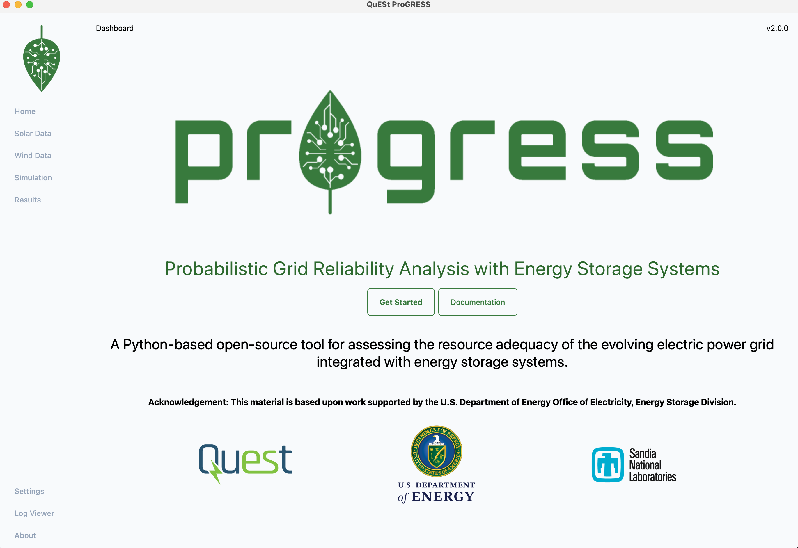
</p>

#### Step 1. Configure ERA5 access

ProGRESS can download solar and wind weather data from the ERA5 dataset through the Copernicus Climate Data Store API. The instructions for setting up the API key can be found [here](https://cds.climate.copernicus.eu/how-to-api). A valid CDS API credential file then needs to be configured at:
```
~/.cdsapirc
```
The application checks for this file when it starts. ERA5 credentials are optional when user provides their own VER generation data.

Select `Get Started` to proceed to the Solar page.

#### Step 2. Prepare solar data

On the `Solar` page, select one of the available data sources:

- Use Your Own Data
- Download Solar Data from ERA5
- No Solar Data

<p align="center">
  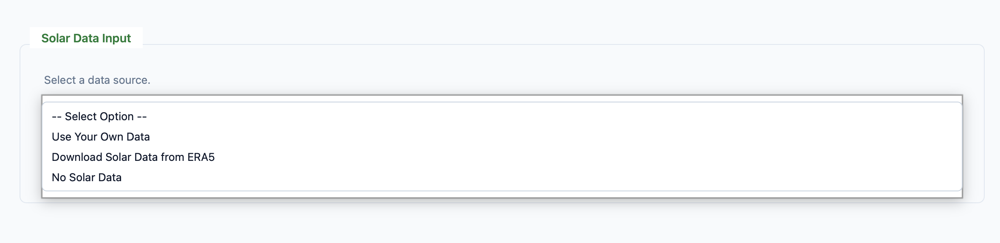
</p>

When using existing data, place `solar_sites.csv` and `gen_all_sites.csv` in the [Solar](./progress/Data/Solar) directory and select the validation option. Column names and site names must follow the formats described in [input_readme](./progress/Data/input_readme.md).

When downloading data, enter the desired start and end years. ProGRESS downloads ERA5 weather data for each location in solar_sites.csv and uses pvlib (https://pvlib-python.readthedocs.io/) to convert the weather data into solar generation profiles.

After solar generation data have been prepared, proceed to the clustering page.

##### Solar clustering

ProGRESS uses k-means clustering to group days with similar solar-generation profiles. During the Monte Carlo simulation, representative days are sampled according to month-specific cluster probabilities.

<p align="center">
  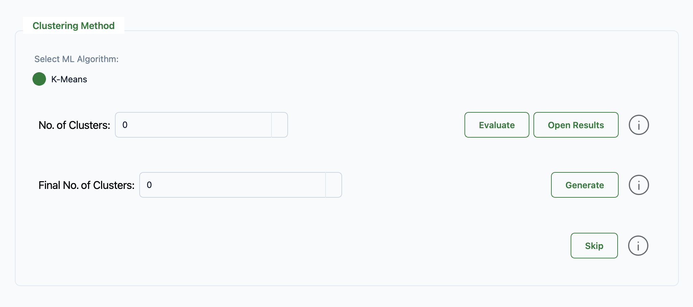
</p>

The clustering page provides two operations:

1. Evaluate clusters: Evaluate a range of cluster counts using metrics such as the sum of squared errors and silhouette score.

<p align="center">
  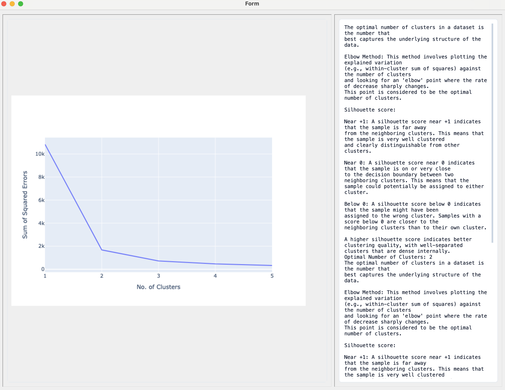
</p>

2. Generate clusters: Select the final number of clusters and generate the cluster profiles and monthly probabilities used by the simulation.

The clustering process creates:

- [solar_probs.csv](./progress/Data/Solar/solar_probs.csv)
- [Clusters](Data/Solar/Clusters/)

If valid cluster files have already been generated previously, the clustering process can be skipped.

If the system contains no solar generation, select `No Solar Data`.

#### Step 3. Prepare wind data

On the Wind page, select one of the available data sources:

- Use Your Own Data
- Download Wind Data from ERA5
- No Wind Data

<p align="center">
  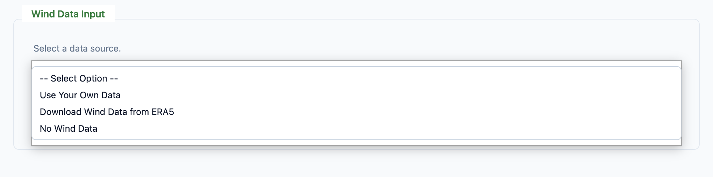
</p>

When using existing data, place `wind_sites.csv`, `w_power_curves.csv`, and `windspeed_data.csv` in the [Wind](./progress/Data/Wind) directory and validate the files.

When downloading data, enter the desired start and end years. ProGRESS downloads ERA5 wind data for each location in `wind_sites.csv` and calculates the corresponding wind-speed time series.

Wind-speed data must be processed before running a simulation. Select `Process Wind Data` to generate the transition-rate matrices used by the stochastic wind model:

[t_rate.xlsx](./progress/Data/Wind/t_rate.xlsx)

This processing step can be skipped if a valid t_rate.xlsx file already exists.

If the system contains no wind generation, select `No Wind Data`.

#### Step 4. Configure the simulation

<p align="center">
  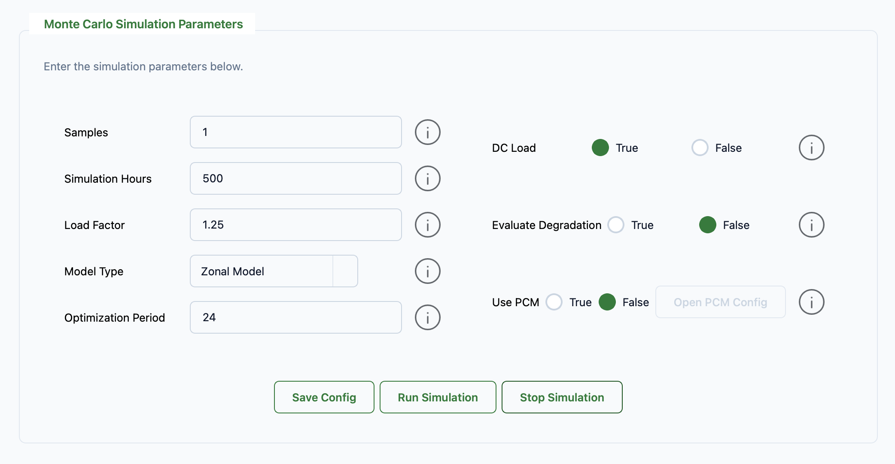
</p>

The Simulation page provides the following settings:

| Setting  | Description                  |
| -------- | ---------------------------- |
| Samples  | Number of Monte Carlo samples to run.|
| Simulation Hours   |       Number of simulated hours per sample. Use 8760 for a full non-leap year.|
| Load Factor        |       Multiplier applied to the base load at every bus. The default is 1.|
| Model Type|        Network representation: Copper Sheet, Zonal, or Nodal.|
| Optimization Period| Use 1 for single-period reliability operation or a multiple of 24 for multi-period dispatch.|
| Data-Center Load| Enables randomly selected data-center load profiles.|
| Evaluate Degradation| Enables battery-capacity degradation during the simulation.|
| Degradation Interval | Number of hours between degradation evaluations. A value of at least 168 hours is recommended.|
| Detailed Thermal Model | Uses the PyBaMM thermal model instead of an assumed constant temperature of 25°C.|
| Use PCM | Enables co-simulation with the QuESt Production Cost Model.|
   
The available network models are:

- Copper Sheet: Ignores transmission constraints and provides the fastest generation-adequacy calculation.
- Zonal: Aggregates buses within each zone and represents power transfers between zones.
- Nodal: Retains the full bus and transmission network for the highest modeling fidelity.

Select `Save Input` to save the displayed settings to [input.yaml](./progress/input.yaml).

##### Battery degradation

When degradation is enabled, ProGRESS evaluates capacity fade using the battery chemistry specified in [storage.csv](.progress/Data/System/storage.csv). Supported chemistries are:

- LMO
- LFP
- NMC
- NCA

The detailed thermal model increases the simulation time substantially. Disable it to use a constant cell temperature of 25°C.

##### Data-center loads

When data-center loads are enabled, ProGRESS randomly selects a profile from the following directory:

[data_center_load](./progress/Data/System/data_center_load)

The selected profile is added to the matching system load columns for each Monte Carlo sample. For a zonal simulation, ProGRESS aggregates bus-level data-center profiles by zone.

##### Production Cost Model integration

When PCM is enabled, select PCM Configuration and provide:

- Path to the Python executable in the QuESt PCM environment
- Simulation start date
- Optimization solver
- MIP gap
- Pricing-problem option
- Storage ancillary-service participation option

PCM integration currently requires:

- The Nodal network model
- A 24-hour optimization period
- A separately installed QuESt PCM environment

*PCM and battery degradation cannot currently be enabled in the same simulation.

#### Step 5. Run the simulation

Select `Run Simulation` to save the current configuration and start the simulation.

Each run creates a timestamped directory in the `Results` folder. 

Simulation messages and progress information are displayed in the log window.

#### Step 6. Review results

Open the Results page after the simulation finishes. The results browser can display:

- CSV tables
- Excel workbooks
- PDF plots
- PNG images
- Text and JSON files
- HTML and Plotly results

Each serial simulation uses the following general output structure:

- progress/Results/
  - YYYY-MM-DD_HH-MM-SS/
      - indices.csv
      - config.txt
      - bus_outage_summary.txt
      - convergence and outage plots
      - Sample_1/
         - ESS_SOC.csv
         - solar_gen.csv
         - wind_gen.csv
         - outage records
         - sample-level plots

The exact files depend on the selected model, number of samples, simulation length, variable generation, degradation settings, and PCM settings.

The calculated reliability indices include:

 |Index  |    Description |
 | ------| ------------- |
 | LOLP  | Loss-of-load probability |
 | LOLH  |  Expected loss-of-load hours |
 | LOLE  | Loss-of-load expectation |
 | LOLF  |  Loss-of-load frequency |
 | EUE   | Expected unserved energy |
 | EPNS  | Expected power not supplied |
 | MDT   | Mean outage duration |

Outage heat maps are generated for full-year simulations of 8,760 hours. LOLP and coefficient-of-variation convergence plots are generated when multiple samples and nonzero loss-of-load events are available. Status of components such as generators, transmission lines, VERs, and ESS are recorded during the outage hours for in-depth analysis. Magnitude and duration of outages at all buses are also summarized for the simulation duration. 

<table>
  <tr>
    <td style="text-align: center;">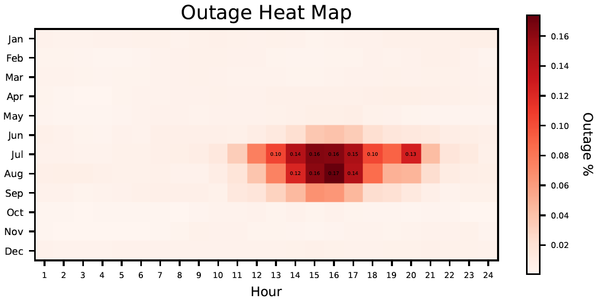</td>
    <td style="text-align: center;"></td>
  </tr>
  <tr>
    <td style="text-align: center;">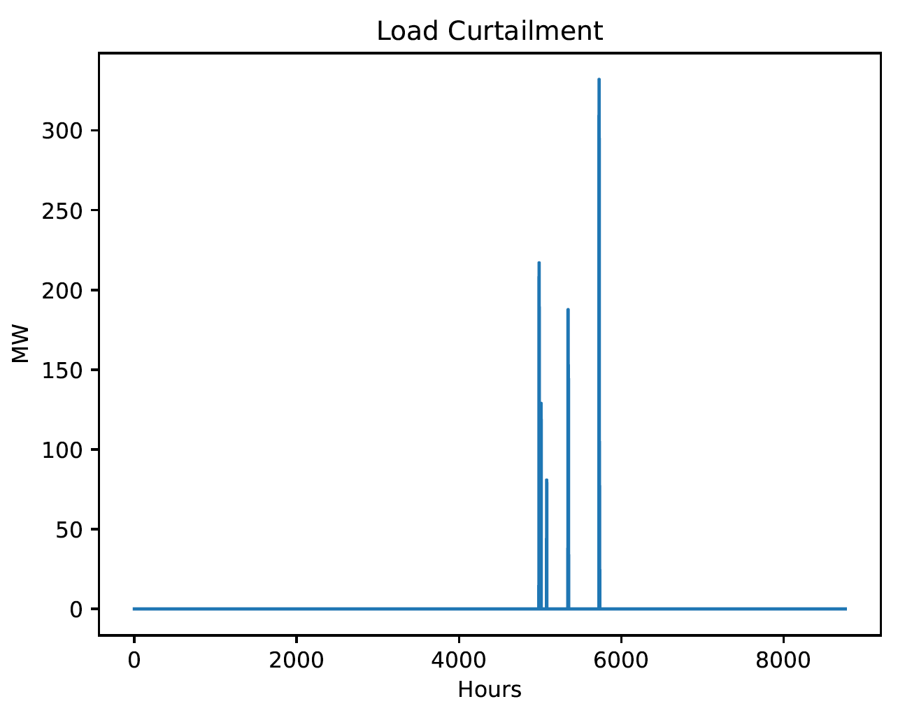</td>
    <td style="text-align: center;">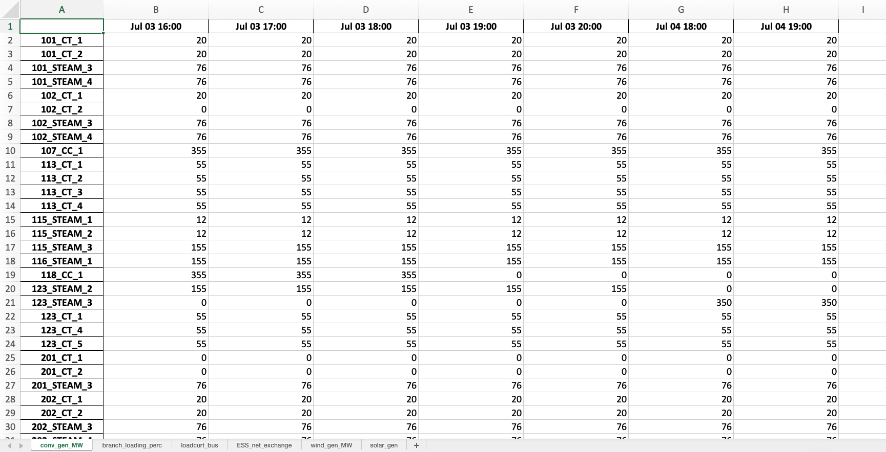</td>
  </tr>
  <tr>
    <td style="text-align: center;">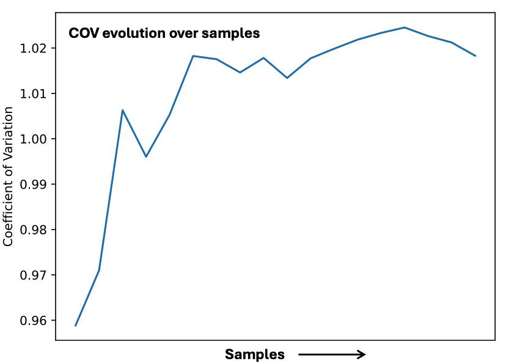</td>
    <td style="text-align: center;">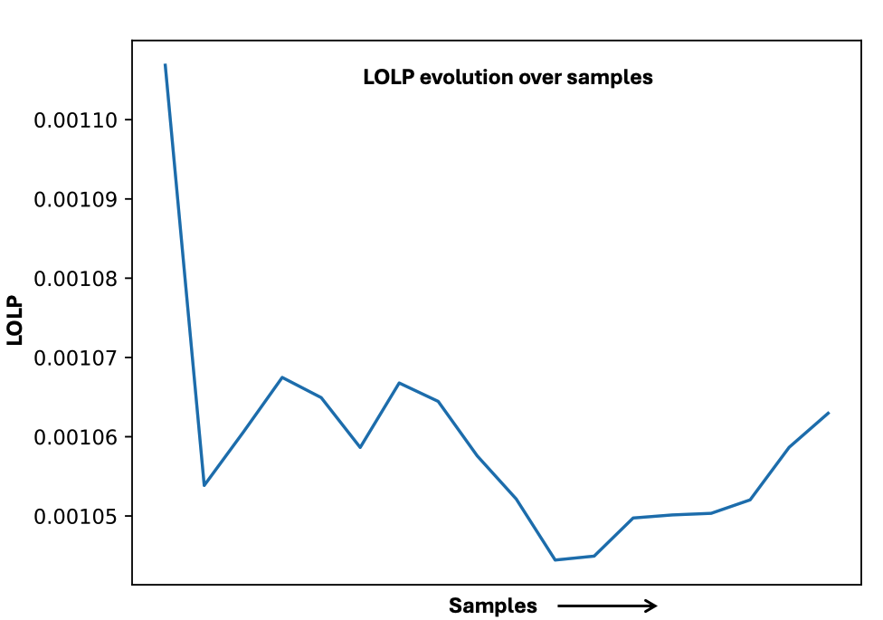</td>
  </tr>
</table>

### B. Command-Line Workflow

ProGRESS simulations can be prepared and executed without the GUI on a local computer or remote server.

Run all module commands from the repository root with the ProGRESS environment activated.

#### Step 1. Configure the input file

Edit the [input.yaml](./progress/input.yaml) to change configuration. 

The primary configuration options are:

| Parameter | Description                  |
| -------- | ---------------------------- |
| data | Path to the root data directory. |
| samples  | Number of Monte Carlo samples to run.|
| sim_hours  |       Number of simulated hours per sample. Use 8760 for a full non-leap year.|
| load_factor|       Multiplier applied to the base load at every bus.|
| model |        Network representation: Copper Sheet, Zonal, or Nodal.|
| optimization_period | Use 1 for single-period reliability operation or a multiple of 24 for multi-period dispatch.|
| download_s | Whether solar weather data should be downloaded. |
| year_start_s, year_end_s  |  ERA5 solar-data year range. |
| n_clusters| Number of solar clusters to generate.|
| download_w | Whether wind weather data should be downloaded.|
| year_start_w, year_end_w | ERA5 wind-data year range.|
| evaluate_degradation| Enables battery-capacity degradation during the simulation.|
| degradation_interval | Number of hours between degradation evaluations. A value of at least 168 hours is recommended.|
| detailed_thermal_model | Uses the PyBaMM thermal model instead of an assumed constant temperature of 25°C.|
| DC_load | Enables data-center load profiles. |
| use_pcm | Enables co-simulation with the QuESt Production Cost Model.|

PCM-specific options are stored under pcm_parameters.

#### Step 2. Prepare variable generation data

If variable generation data must be downloaded or processed, run:

```
python -m progress.data_download_process
```

This workflow can:

- Download ERA5 meteorological data required for calculating VER generation.
- Convert solar weather data to solar generation
- Generate solar clusters and monthly probabilities
- Generate wind transition-rate matrices

This step can be skipped when all required processed VER files already exist.

#### Step 3. Run the simulation

Run the simulation using the default configuration:
```
python -m progress.example_simulation
```

A different configuration file can be supplied with --config:

```
python -m progress.example_simulation \
    --config /path/to/input.yaml
```

A custom results directory can be supplied with --out:

```
python -m progress.example_simulation \
    --config /path/to/input.yaml \
    --out /path/to/results
```

If --out is omitted, ProGRESS creates a timestamped directory under progress/Results.

### C. High-Performance Computing Workflow

ProGRESS includes an MPI-enabled simulation for running additional Monte Carlo samples across multiple processes. This workflow is intended for large systems, long simulations, or convergence studies requiring many samples.

An MPI runtime and the mpi4py Python package must be available on the computing system.

#### Interactive MPI execution

From the repository root, run:
```
mpiexec -n x python -m progress.example_simulation_mult_proc \
    --config progress/input.yaml \
    --out /path/to/results
```

Replace x with the desired number of MPI processes.

The samples setting is applied to each MPI process. Therefore, the total number of simulated samples is:
```
total samples = samples × MPI processes
```
Rank zero aggregates the reliability indices and generates the combined convergence and outage results.

#### Scheduled HPC execution

The exact scheduler command and resource directives depend on the computing facility. For a Slurm system, place the MPI command in an appropriate batch script and submit it with:
```
sbatch your_job_script.bash
```
Consult the documentation for the target HPC system when selecting the number of nodes, tasks, memory, wall time, account, and partition.

[Back to Top](#top)

## Sample Case Study

A test case is included with this tool. The test system is the [IEEE RTS-GMLC](https://ieeexplore.ieee.org/abstract/document/8753693), which is a modernized version of the [IEEE RTS-96](https://ieeexplore.ieee.org/abstract/document/780914). A zonal model of the test system is illustrated as follows:

<p align="center">
  
</p>

All test system data provided with the tool has been taken from the [RTS-GMLC GitHub repository](https://github.com/GridMod/RTS-GMLC).

## Additional Features

Some additional features have been introduced to the ProGRESS tool. These features are currently available only for command line simulations in [example_simulation.py](./progress/example_simulation.py) and [example_simulation_multi_proc.py](./progress/example_simulation.py).

**a) Single and multi-period optimization models:**

ProGRESS now supports both single-period and multi-period optimization models within the Monte Carlo framework. Single-period optimization is designed to run the energy storage systems in reliability support mode, i.e. they only discharge to reduce load curtailments and maintain full state-of-charge otherwise. In the multi-period optimization, storage serves two purposes: operate to reduce the system operation fuel costs and support the grid during load curtailment events. Users can select the optimization mode using the `optimization_period` parameter in the [input.yaml](progress/input.yaml) file. We recommend running multi-period option with 24 hour periods for a high computational performance.

<p align="center">
    | |  
</p>

**b) Cathode-chemistry specific degradation models:**

ProGRESS now supports cathode-chemistry specific battery degradation models for energy storage systems. Users can now specify the cell cathode chemistry in the [storage.csv](./progress/Data/System/storage.csv) file. Currently, there are four battery chemistry choices: LMO (derived from [Xu et. al.](https://ieeexplore.ieee.org/document/7488267)) and LFP, NMC, NCA (derived from [Preger et. al.](https://iopscience.iop.org/article/10.1149/1945-7111/abae37/meta)). Details on the stress-factor-based degradation models using in this tool can be found in [this paper](https://ieeexplore.ieee.org/abstract/document/11404120). For degradation analysis, in the [input.yaml](progress/input.yaml) file, following parameters need to be provided:

| Parameter                | Comments                                                                                                                                                                                                       |
| ------------------------ | -------------------------------------------------------------------------------------------------------------------------------------------------------------------------------------------------------------- |
| `evaluate_degradation`   | Set to True to consider energy storage degradation in the simulation.                                                                                                                                          |
| `degradation_interval`   | Use this parameter (in hours) to configure how often degradation is evaluated and enforced. Recommended: 168 hours (1 week) or more.                                                                           |
| `detailed_thermal_model` | Set to True to use detailed [PyBaMM](https://pybamm.org/) thermal model for degradation calculations. Enabling this option will increase computation time. If set to False, constant 25 C temperature is used. |

Users can view the impacts of cell degradation and failures in the `ESS_cap.pdf` file, which can be found in the `Results` folder.

|  |  |  |
|:------------------------------:|:------------------------------:|:------------------------------:|
| (a) Capacity failure only | (b) Capacity degradation only | (c) Combined failure and degradation |

**c) High-Fidelity Production Cost Simulations within ProGRESS:**

ProGRESS now supports Production Cost Modeling (PCM) simulations within its Monte Carlo reliability assessment framework. To use this capability, the [QuESt PCM](<https://github.com/sandialabs/quest_PCM>) tool must be downloaded and installed. During a ProGRESS simulation, stochastic scenarios are generated and automatically exported to QuESt PCM, where they are used to perform detailed nodal production cost simulations. QuESt PCM executes a series of day-ahead unit commitment while modeling conventional generators, renewable resources, energy storage systems, transmission constraints, and ancillary service markets in detail. This integrated workflow enables users to assess the operational and economic impacts of stochastic reliability events using a high-fidelity production cost model. The following steps describe how to configure and run the integrated framework.

- **Clone the QuESt PCM tool into your machine:** The ``progress_integration`` branch of QuESt PCM needs to be used using the command below:
```bash
git clone -b progress_integration https://github.com/sandialabs/quest_PCM.git
```

- **Create a QuESt PCM virtual environment:** Using python 3.12, create the virtual environment as follows:
```bash
# On Windows:
py -3.12 -m venv pcm_venv
# On macOS/Linux:
python3.12 -m venv pcm_venv
```

> **Note:** On macOS, `python3.12` is typically installed via Homebrew. If you don't have it, run `brew install python@3.12`. The resulting venv's python executable will be at `<path_to_quest_PCM>/pcm_venv/bin/python3.12`.

- **Install QuESt PCM:**  With the virtual environment activated, install QuESt PCM and it's dependencies as follows:
```bash
pip install -e .
```

- **Populate required parameters in the config file:** The config `input.yaml` file must contain the following parameters:

| Parameter      | Comments                   |
|--------------|-----------------------------------|
|`pcm_venv_path`| Full path to the QuESt PCM virtual environment python executable. Example: "C:/John_Doe/snl-progress/progress_venv/Scripts/python.exe". 
|`start_date`|  start date for PCM simulation in MM/DD/YYYY format. End date is determined based on user defined `sim_hours`.|
|`solver`| Solver to be used for PCM optimization; Options are 'gurobi', 'cplex', 'cbc', etc. |
|`mipgap`| MIP gap for PCM optimization; lower values lead to more optimal solutions but increase computation time. |
|`solve_pricing_problem`| True/False based on whether user wants to solve the pricing problem in PCM. Increases computation time but generates LMPs, revenues, etc.|
|`storage_AS_mode`| True/False based on whether user wants to include BESS participating in ancillary services.|

 


[Back to Top](#top)

## Citing ProGRESS

<a id="cite"></a>

If you use ProGRESS in your research, please cite the following paper:

A. Bera, C. J. Newlun, A. Lopez, Y. -J. Pomeroy, T. Nguyen and R. Byrne, "Probabilistic Grid Reliability Analysis with Energy Storage System (ProGRESS): An Open-Source Tool for Assessing the Reliability of Power Systems," 2025 IEEE Electrical Energy Storage Applications and Technologies Conference (EESAT), Charlotte, NC, USA, 2025, pp. 1-5, doi: 10.1109/EESAT62935.2025.10891214.

Bibtex Entry:

@inproceedings{bera2025probabilistic, <br>
title={Probabilistic Grid Reliability Analysis with Energy Storage System (ProGRESS): An Open-Source Tool for Assessing the Reliability of Power Systems}, <br>
author={Bera, Atri and Newlun, Cody J and Lopez, Andres and Pomeroy, Yung-Jai and Nguyen, Tu and Byrne, Ray}, <br>
booktitle={2025 IEEE Electrical Energy Storage Applications and Technologies Conference (EESAT)}, <br>
pages={1--5}, <br>
year={2025}, <br>
organization={IEEE} <br>
}

## Acknowledgment

<a id="acknowledgement"></a>
The ProGRESS tool is developed and maintained by the [Energy Storage Analytics Group](https://energy.sandia.gov/programs/energy-storage/analytics/) at [Sandia National Laboratories](https://www.sandia.gov/). This material is based upon work supported by the **U.S. Department of Energy, Office of Electricity (OE), Energy Storage Division**.

**Project team:**

- Atri Bera
- Dilip Pandit
- Eriel Cabrera
- Andres Lopez
- Yung-Jai Pomeroy
- Cody Newlun
- Tu Nguyen


|  |  |
| ------------------------------------------------------------------------------------- | ----------------------------------------------------------------------------------------------- |

[Back to Top](#top)

## Contact

<a id="contact"></a>

For reporting bugs and other issues, please use the "Issues" feature of this repository. For more information regarding the tool and collaboration opportunities, please contact project developer: Atri Bera (`abera@sandia.gov`)
