<p align="center">
  
</p>

# <ins>Pro</ins>babilistic <ins>G</ins>rid <ins>R</ins>eliability Analysis with <ins>E</ins>nergy <ins>S</ins>torage <ins>S</ins>ystems (ProGRESS)

Current release version: v2.0.0

Release date: 07/15/2026

## Table of Contents

- [Introduction](#intro)
- [Key Features of ProGRESS](#key-features)
- [Getting Started](#getting-started)
- [Data Requirements](#data)
- [Workflow Description](#workflow)
- [Citing ProGRESS](#cite)
- [Contact](#contact)

## Introduction

<a id="intro"></a>

**Probabilistic Grid Reliability Analysis with Energy Storage Systems (ProGRESS)** is an open-source, Python-based software tool for assessing the resource adequacy of modern electric power systems with high penetrations of energy storage systems (ESS), variable energy resources (VER), and emerging large loads such as AI data centers. ProGRESS employs a Markov Chain Monte Carlo (MCMC) stochastic simulation engine to generate thousands of diverse operating scenarios that capture the uncertainty and variability of future power systems.

The tool includes detailed, state-of-the-art ESS models that represent charge-discharge behavior, state-of-charge (SOC) evolution, failures, repairs, and technology-specific degradation mechanisms, enabling realistic assessment of storage availability and performance over time. Multiple ESS operating modes are supported, including **reliability mode**, **economic dispatch mode**, and **market participation mode** through integration with the **QuESt PCM** tool, allowing users to evaluate storage performance under a variety of operational strategies.

ProGRESS also models the uncertainty associated with VERs by incorporating historical weather-driven generation data, enabling users to simulate thousands of diverse generation scenarios that reflect realistic operating conditions. Users can build custom power system models, download and integrate historical VER datasets through supported APIs, and perform comprehensive probabilistic reliability analyses. The software quantifies expected outage frequency, duration, and magnitude using industry-standard reliability metrics while also providing detailed reliability assessments at the **individual bus level**, enabling users to identify localized reliability risks and evaluate the impact of storage and generation resources across the network.

By combining advanced stochastic simulation, detailed component modeling, and flexible ESS operating strategies, ProGRESS enables planners, researchers, and system operators to evaluate reliability tradeoffs, assess the value of energy storage, and make informed decisions for the planning and operation of future electric grids.


[Back to Top](#top)


## Key Features of ProGRESS
<a id="key-features"></a>

- **Probabilistic resource-adequacy assessment**: Uses sequential Monte Carlo simulation to model stochastic failures and repairs of generators, transmission lines, and energy-storage systems. It calculates reliability metrics including LOLP, LOLH, LOLE, LOLF, EUE, EPNS, and mean outage duration.

- **Comprehensive energy-storage modeling**: Represents ESS charge/discharge behavior, state of charge, efficiency, operating limits, duration,
    component availability, failures, and repairs. It supports single-period reliability operation and multi-period economic dispatch, as well
    as chemistry-specific degradation models for LMO, LFP, NMC, and NCA batteries. Degradation can account for depth of discharge, state of
    charge, C-rate, cycling, and temperature using an optional [PyBaMM](https://pybamm.org/) thermal model.

- **Flexible power-system and optimization models**: Supports copper-sheet, zonal, and nodal network representations, enabling users to balance
    computational speed and transmission detail. Configurable optimization horizons support both reliability-focused operation and multi-
    period dispatch considering generation costs, renewable curtailment, storage scheduling, and load shedding.

- **Variable generation and uncertainty modeling**: Accepts user-provided variable generation data or downloads ERA5 meteorological data through the
    [Copernicus Climate Data Store](https://cds.climate.copernicus.eu/datasets/reanalysis-era5-single-levels?tab=overview). Solar generation is calculated using [pvlib](https://pvlib-python.readthedocs.io/en/stable/) and modeled stochastically with k-means clustering and month-specific probabilities. Wind generation uses configurable turbine power curves and transition-rate matrices.

- **Data-center load modeling**: Incorporates data-center demand into resource-adequacy studies using user-provided collections of load
    profiles. ProGRESS randomly selects a profile for each Monte Carlo sample, adds it to matching system load buses, and can aggregate bus-
    level data-center demand into zone-level profiles for zonal studies.

- **Production-cost-model integration**: Integrates with [QuESt PCM](https://github.com/sandialabs/quest_PCM) for detailed nodal day-ahead unit commitment and economic dispatch, including
    generator and transmission outages, renewable availability, storage constraints, ancillary services, and optional pricing calculations.

- **Detailed results and visualization**: Generates per-sample records for load curtailment, generator dispatch, transmission
    flows, ESS state of charge, and ESS capacity. Aggregate outputs include reliability indices, convergence plots, outage heat maps, and bus-
    level outage frequency and magnitude rankings. A built-in results browser can be used to preview CSV, Excel, PDF, PNG, text, JSON, and HTML results.

- **Accessible and scalable workflows**: Provides a desktop GUI for data preparation, validation, simulation configuration, execution, logging, and results review. Simulations can also run from the command line or across multiple MPI processes on high-performance computing systems.

- **Customizable and reproducible open-source platform**: Uses documented CSV schemas for custom grid, load, storage, solar, and wind datasets, with an [RTS-GMLC](https://github.com/GridMod/RTS-GMLC) example included. Its modular Python architecture supports research extensions, while timestamped result directories and saved configuration snapshots make runs easier to reproduce.

[Back to Top](#top)

## Getting started

<a id="getting-started"></a>

### Easy Installation (Windows Executable)

Follow these steps to install and run the Progress executable on Windows:

1. **Download the Executable**
   - Go to the **Releases** section of this repository.
   - Download the `win_progress_v_1.2.0.zip` file containing the executable.

2. **Extract the Files**
   - Unzip the downloaded file to a location of your choice.

3. **Run the Executable**
   - Navigate to the extracted folder.
   - Double-click on `progress.exe` to launch the package.

4. **Ensure Data Folder is properly structured**
   - The data folder is found in the following path relative to progress.exe:
     ```
     Lib/progress/Data
     ```
   - The correct structure for the Data folder can be found [here](#data).

5. **Download a Solver**
   - The executable requires a solver to function, the instructions for downloading one can be found [here](#solver).

### Manual Installation Instructions

### Prerequisites

- Python (>= 3.9, <3.12) installed on your system
- Git installed on your system

### Installing Python

1. Installers can be found at: https://www.python.org/downloads/release/python-3913/
2. Make sure to check the box "Add Python to PATH" at the bottom of the installer prompt.

### Installing Git

- Visit [git-scm.com](https://git-scm.com/) to download Git for your operating system.
- Follow the installation instructions provided on the website.

### Setting Up a Virtual Environment

1. Open Command Prompt on Windows or Terminal on macOS and Linux.
2. Install `virtualenv` (if not already installed):
   ```
   python -m pip install virtualenv
   ```
3. Create a virtual environment:
   ```
   cd <your_path>
   python -m virtualenv <env_name>
   ```
   Replace `<your_path>` with the path to the folder where you want to create the virtual environment.
4. Activate the virtual environment:
   - On Windows:
     ```
     cd <your_path>
     .\<env_name>\Scripts\activate
     ```
   - On macOS/Linux:
     ```
     source <env_name>/bin/activate
     ```

### Installing ProGRESS

1. Clone the Repository:

   ```bash
   git clone https://github.com/sandialabs/snl-progress.git
   ```

2. Navigate to the `snl_progress` Directory:

   ```bash
   cd <path_to_snl-progress>
   ```

3. Install Dependencies:
   ```bash
   python -m pip install -r requirements.txt
   ```

<a id="solver"></a>

### Solver Installation

Ensure an optimization solver is installed on your machine. Solvers to consider include:

**Open-source Solvers**

- [GLPK](https://www.gnu.org/software/glpk/)
- [Clp](https://github.com/coin-or/Clp)
- [HiGHs](https://highs.dev/#top)

**Commercial Solvers**

- [Gurobi](https://www.gurobi.com/)
- [Cplex](https://www.ibm.com/products/ilog-cplex-optimization-studio)

[Back to Top](#top)

## Data Requirements

<a id="data"></a>

Users must create a `Data` folder inside the `progress` directory with the subfolders `System`, `Solar`, and `Wind` to store system, solar, and wind data, respectively. These subfolders must contain the following data files in the directory structure shown below:

- README.md
- LICENSE
- progress/
  - Data/
    - System/
      - branch.csv
      - bus.csv
      - gen.csv
      - load.csv
      - storage.csv
      - data_center_load (if DC load exists in the system)/               
        - profile_*.csv 
    - Solar (if solar exists in system)/
      - solar_sites.csv
      - gen_all_sites.csv (if solar power generation data is user provided)
      - solar_probs.csv (generated by clustering, not user-provided)
      - Clusters (generated by clustering, not user-provided)  
    - Wind (if wind exists in system)/
      - w_power_curves.csv
      - wind_sites.csv
      - windspeed_data.csv (if wind speed data is user provided)
      - t_rate.xlsx (generated from wind-speed data, not user-provided)

The file names should be kept exactly the same as shown above. The column names inside each `.csv` file should also be left unchanged. File templates with data from the RTS-GMLC system are provided here: [`Data`](./progress/Data).
A detailed description of the `.csv` files along with the column names is provided as follows:

### System

#### `branch.csv`

| Column      | Description                                                   |
| ----------- | ------------------------------------------------------------- |
| Branch ID   | Unique branch ID                                              |
| From Bus    | From Bus ID                                                   |
| To Bus      | To Bus ID                                                     |
| R           | Branch resistance p.u.                                        |
| X           | Branch reactance p.u.                                         |
| B           | Branch line charging susceptance p.u.                         |
| Rating      | Power transfer capacity                                       |
| MTTR       | Mean Time to Repair                                           |
| MTTF        | Mean Time to Failure                                          |
| Tran OutRate | Outage rates of transmission lines                            |
| Interzonal  | Y/N based on whether the line connects multiple zones/regions |

#### `bus.csv`

| Column   | Description                  |
| -------- | ---------------------------- |
| Bus Name | Bus/Zone name                |
| Bus No.  | Numeric bus ID               |
| Zone     | Zone in which bus is located |

#### `gen.csv` 

| Column   | Description                  |
| -------- | ---------------------------- |
| Gen No.  | Numeric gen ID               |
| Gen Name | Generator name               |
| Bus No.  | Connection bus/zone number   |
| Zone     | Zone in which gen is located |
| Type     | Technology Type              |
| Fuel     | Fuel Type                    |
| Max Cap  | Maximum capacity of unit     |
| Min Cap  | Minimum capacity of unit     |
| FOR      | Forced Outage Rate           |
| MTTR     | Mean Time to Repair          |
| MTTF     | Mean Time to Failure         |
| Cost     | Cost of generation           |

Additional data will be required for PCM runs. Please check additional features documentation. 

#### `load.csv`

| Column   | Description                       |
| -------- | --------------------------------- |
| datetime | mm/dd/yy hh:mm                    |
| Bus_1    | Load in bus1                      |
| Bus_2    | Load in bus2                      |
| ...      | Keep adding columns for all buses |

Replace `Bus_1`, `Bus_2`, ... with the actual bus names for your system. This should match the bus names in `bus.csv`.

#### `storage.csv`

| Column         | Description                              |
| -------------- | ---------------------------------------- |
| Name           | Name of storage unit                     |
| Bus No.        | Bus No. to which it is connected         |
| Zone           | Zone to which it is connected            |
| Pmax           | Maximum power rating                     |
| Pmin           | Minimum power rating                     |
| Duration       | Duration in hours                        |
| max_SOC        | Maximum allowed state-of-charge (0 to 1) |
| min_SOC        | Minimum allowed state-of-charge (0 to 1) |
| Efficiency     | Efficiency (0 to 1)                      |
| Discharge Cost | Cost of discharge                        |
| Charge Cost    | Cost of charge                           |
| Units          | No. of subunits in the ESS               |
| MTTR           | Mean Time to Repair                      |
| MTTF           | Mean Time to Failure                     |
| Chemistry      | Chemistry of BESS                        |

#### `profile_n.csv` in `data_center_load` directory (optional)

| Column | Description                                |
| ------ | ------------------------------------------ |
| time | date time in YYYY-MM-DD HH:MM:SS format    |
| Bus_1 | hourly peak load values from data center in bus 1 in MW |
| Bus_2 | hourly peak load values from data center in bus 2 in MW  |
| ...    | Keep adding columns for all data centers   |

Replace `Bus_1`, `Bus_2`, ... with the actual bus names for your system. This should match the bus names in `bus.csv`.

### Solar

#### `solar_sites.csv`

| Column      | Description                                    |
| ----------- | ---------------------------------------------- |
| Site Name   | Name of the solar site                         |
| Latitude    | latitude of the site                           |
| Longitude   | longitude of the site                          |
| MW_Capacity | Maximum generating capacity of the plant in MW |
| Tracking    | Single/Dual axis tracking (1 or 2)             |
| Bus No.     | Bus No. to which it is connected               |
| Zone        | Bus/zone in which site is located              |

#### `gen_all_sites.csv` (if solar power generation data is user provided)

| Column | Description                                |
| ------ | ------------------------------------------ |
| time   | date time in YYYY-MM-DD HH:MM:SS format    |
| site_1 | hourly generation values from site_1 in MW |
| site_2 | hourly generation values from site_2 in MW |
| ...    | Keep adding columns for all solar sites    |

Replace `site_1`, `site_2`, ... with the actual site names for your system. This should match the site names in `solar_sites.csv`.

### Wind

#### `wind_sites.csv`

| Column         | Description                                    |
| -------------- | ---------------------------------------------- |
| Site Name      | Name of wind farm                              |
| Bus No.        | Bus No. to which it is connected               |
| Zone           | Zone in which wind farm is located             |
| MW_Capacity    | Maximum generating capacity of the plant in MW |
| Power Class    | Wind power class                               |
| Latitude       | Latitude of the site                           |
| Longitude      | Longitude of the site                          |
| Hub Height     | Height of wind turbines                        |
| Turbine Rating | Rating of wind turbines in MW                  |

#### `w_power_curves.csv`

| Column      | Description                                      |
| ----------- | ------------------------------------------------ |
| Start (m/s) | Starting wind speed for this class in (m/s)      |
| End (m/s)   | Ending wind speed for this class in (m/s)        |
| Class 1     | Conversion ratio from speed to power for Class 1 |
| Class 2     | Conversion ratio from speed to power for Class 2 |
| ...         | Users can add as many wind classes as they want  |

#### `windspeed_data.csv` (if wind speed data is user provided)

| Column       | Description                       |
|--------------|-----------------------------------|
| datetime     | date time in YYYY-MM-DD HH:MM format|
|site_1 | hourly wind speed values for site_1 in m/s|
|site_2 | hourly wind speed values for site_1 in m/s|
| ...   | Keep adding columns for all wind sites |

Replace `site_1`, `site_2`, ... with the actual site names for your system. This should match the site names in `wind_sites.csv`.

[Back to Top](#top)

## Workflow Description

<a id="workflow"></a>

ProGRESS can be run through three workflows:

  1. The graphical user interface (GUI)
  2. The command line on a local computer or remote server
  3. Parallel processing with MPI on a high-performance computing system

  Before starting a simulation, ensure that the required system and renewable data follow the structure
  described in the [Data Requirements](#data) section.

### A. Graphical User Interface Workflow

From the repository root, activate the ProGRESS Python environment and launch the application:
```bash
python -m progress
```
The application opens the ProGRESS home page and a separate log window. The log window displays information about data processing, simulation progress, warnings, and errors.

#### Step 1. Configure ERA5 access

ProGRESS can download solar and wind weather data from the ERA5 dataset through the Copernicus Climate Data Store API. The instructions for setting up the API key can be found [here](https://cds.climate.copernicus.eu/how-to-api). A valid CDS API credential file then needs to be configured at:
```
~/.cdsapirc
```
The application checks for this file when it starts. ERA5 credentials are optional when user provides their own VER generation data.

Select `Get Started` to proceed to the Solar page.

**Step 2a.** Users may upload their own solar power generation data using the format specified in this [file](./progress/Data/Solar/solar_data.xlsx) or download solar weather data from [NSRDB](https://nsrdb.nrel.gov/) and convert to solar power generation data using the tool. If downloading data, please check for the data availability at the website since the range of years for which data is available is updated periodically. ProGRESS uses [pvlib](https://pvlib-python.readthedocs.io/en/stable/) to convert the downloaded solar weather data to solar power generation data. In case the user does not have solar installation in their system, they can select the `No Solar` option from the drop down list.

<p align="center">
    |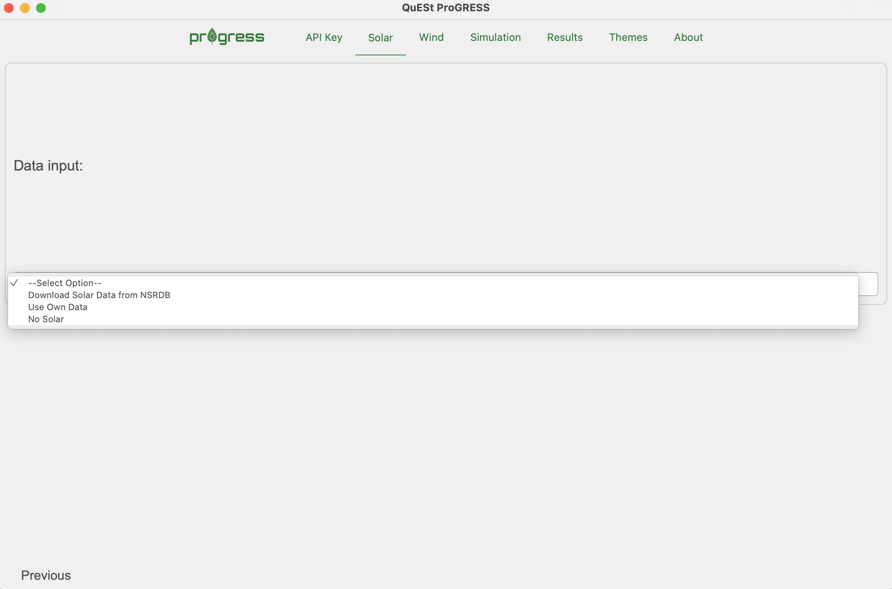 | 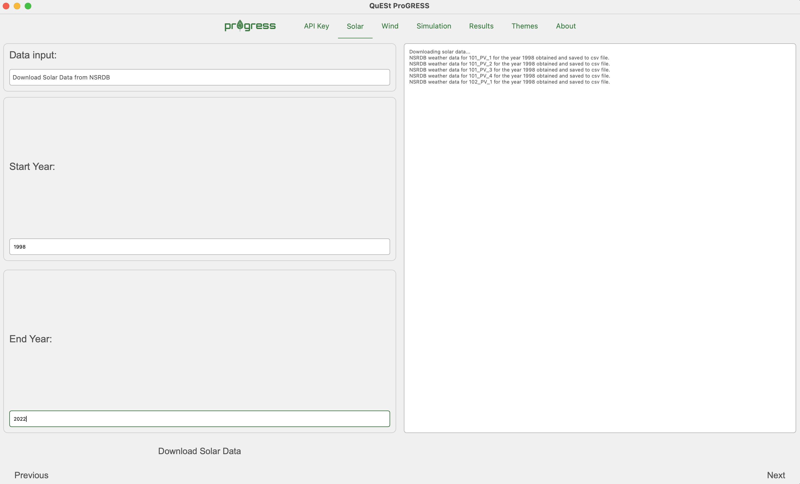 |
</p>

**Step 2b.** The next step involves clustering the solar power generation data. A k-means clustering algorithm is utilized to cluster the data into days with similar solar power generation patterns and values. These clusters are later utilized by the MCS to randomly select days based on the month of the year. Users are able to choose the optimum number of clusters by evaluating the performance of different cluster values. For example, if the user inputs `10` in the `No. of Clusters to Evaluate` field, the tool will evaluate the performance of clusters starting from `2` to `10`. The SSE and silhouette scores will be displayed on the GUI once the evaluation is complete and can be used to make informed decision on the optimal number of clusters.

<p align="center">
  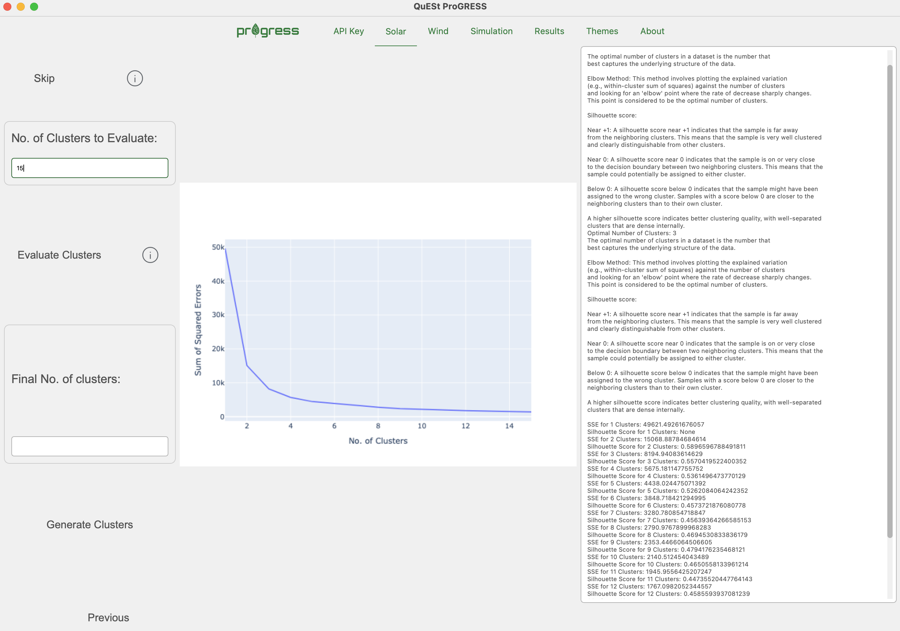
</p>

**Step 3.** The next step involves adding wind data. Users may choose to upload their own wind speed data using the format specified in this [file](./progress/Data/Wind/windspeed_data.csv) or download the same from [Wind Integration National Dataset Toolkits](https://www.nrel.gov/grid/wind-toolkit.html). The windspeed data can then be used to generate a transition rate matrix using the `Process Wind Speed Data` button. The transition rate matrix will eventually be used by the MCS to estimate the wind power generation for each hour. In case the user does not have wind installation in their system, they can select the `No Wind` option from the drop down list.

<p align="center">
    |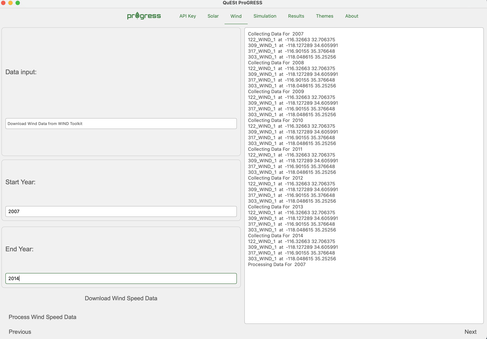| |
</p>

**Step 4.** Once all data has been added, the user can now run the simulation. Guidelines for adjusting the parameters on this page can be found [here](#2step1). Press the `Run Simulation` button once all the information is entered. The simulation progress will be displayed on the right side of the page.

<p align="center">
  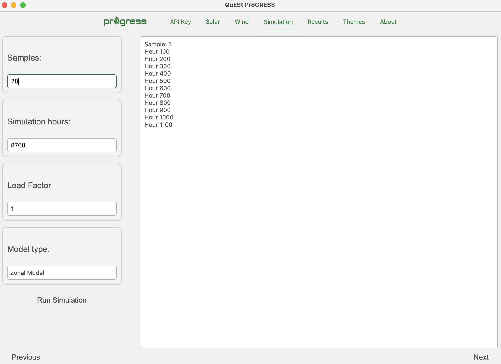
</p>

<a id="results"></a>
**Step 5.** Users may view the results within the application using the results viewer once the simulation is complete.

<p align="center">
  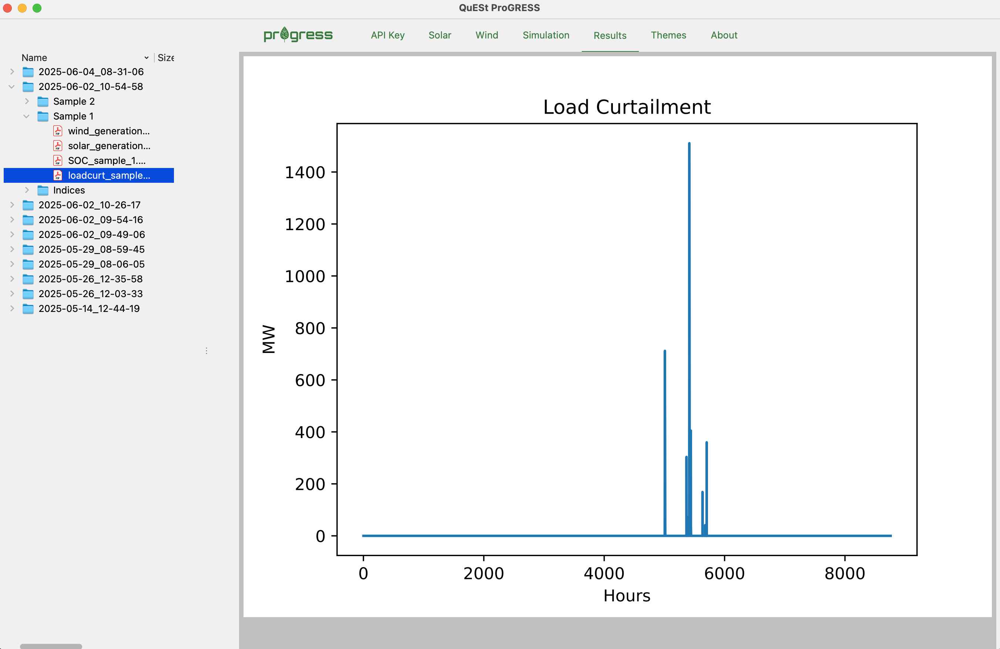
</p>

Results are stored in a distinct folder for each run, the timestamp included in the folder name indicating a particular run. Some results, including load curtailment, solar and wind generation, and ESS SOC evolution are stored for each sample of the run in distinct folders within the directory created for that run. Other results, including system reliability indices, evolution of the LOLP (bottom right) and Coefficient of Variation (COV) across all samples, and heat maps of outages across different months of the year and hours of the day are stored in a separate folder titled `Indices`. These results are indicators of overall system reliability health while the results for the individual samples provide insight into the conditions that led to outages for those samples.

<table>
  <tr>
    <td style="text-align: center;"></td>
    <td style="text-align: center;"></td>
  </tr>
  <tr>
    <td style="text-align: center;"></td>
    <td style="text-align: center;"></td>
  </tr>
  <tr>
    <td style="text-align: center;">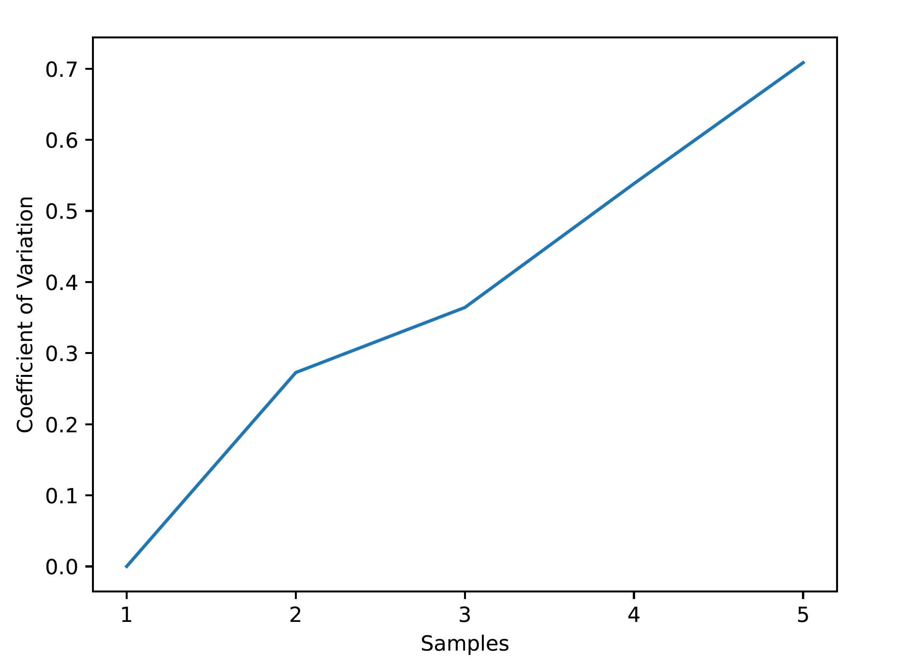</td>
    <td style="text-align: center;">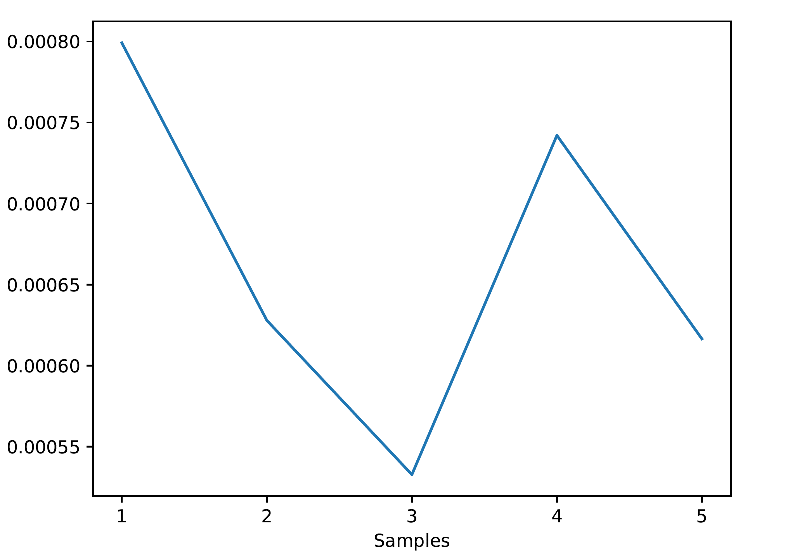</td>
  </tr>
</table>

### B. Instructions for Running Simulations using the Command-Line on Local or Remote Computers/Servers

ProGRESS offers the capability to run simulations through script-based execution without the use of the GUI. These scripts can run on local computers or remote servers. Ensure that you have followed the steps outlined in [Getting Started](#getting-started) for installing the required software and setting up the environment necessary for running the tool. Then navigate to the [progress](./progress) directory and ensure that the virtual environment is activated.

<a id="2step1"></a>
**Step 1. Configure the Input File:**

Before running the simulation, configure the [input.yaml](progress/input.yaml) file with the specific simulation parameters. Open the file in a text editor and adjust the parameters according to your requirements. The `api_key`, `email`, `affiliation`, and `name` fields are required for downloading weather data from the [NSRDB](https://nsrdb.nrel.gov/) and [Wind Integration National Dataset Toolkits](https://www.nrel.gov/grid/wind-toolkit.html). Ensure that you have signed up at the [NREL Developer Network](https://developer.nrel.gov/) beforehand using your details and obtained the required api key. Also check the data availability at the websites as the range of years for which data is available is updated periodically. Guidance on setting the simulation parameters are provided as follows:

| Parameter     | Comments                                                                                                                                                                                                                                                                                                                                                                                                                                                                                                            |
| ------------- | ------------------------------------------------------------------------------------------------------------------------------------------------------------------------------------------------------------------------------------------------------------------------------------------------------------------------------------------------------------------------------------------------------------------------------------------------------------------------------------------------------------------- |
| `samples`     | This is the number of samples that needs to be run for the MCS to converge and depends heavily on the system. Running a small number of samples (e.g., 10-20) might provide a trend of expected outages in the system, although it is recommended that the users run as many samples as required for the MCS to converge for more accurate results. The convergence can be tracked using the Coefficient of Variation (COV) metric plotted in the `COV_track.pdf` file, which can be found in the `Results` folder. |
| `sim_hours`   | The recommended number is 8760 hours or one full year for each sample.                                                                                                                                                                                                                                                                                                                                                                                                                                              |
| `load_factor` | Default value is 1. Users may tune this parameter to check how increasing or decreasing the hourly load profile by a constant factor affects system outages.                                                                                                                                                                                                                                                                                                                                                        |
| `model`       | Users can select the `Copper Sheet Model` option for generation adequacy analysis where the transmission lines are not considered, or the `Zonal Model` option for a composite system reliability analysis, where a transportation model of the system is considered. The `Copper Sheet model` runs faster but the `Zonal Model` might generate for accurate results.                                                                                                                                               |

<a id="2step2"></a>
**Step 2. Download Weather Data:**

Run the [data_download_process.py](./progress/data_download_process.py) file to download the required solar weather and wind speed data using the NREL API.

```bash
python -m progress.data_download_process
```

Running this file will also process the downloaded weather data and convert them into solar and wind power generation data for each site. Users may skip this step if they want to use their own data or have already downloaded and processed the data during a previous run.

**Step 3. Run Monte Carlo Simlulation**

The final step would be to run the [example_simulation.py](./progress/example_simulation.py) file.

```bash
python -m progress.example_simulation
```

Running this file executes the MCS for the pre-specified number of samples and generates results that include values of system reliability indices, outage heatmaps, ESS state-of-charge, solar and wind generation plots, and the coefficient of variation. All results will be stored in the [Results](./progress/Results) folder once the simulation is complete. Please refer to [Step 8](#results) of the previous section for more details on results.

### C. Instructions for Running Simulations on a High Performance Computer (Parallel Computation)

This approach is strongly recommended for users having access to a HPC system and running the tool for analyzing the reliability of large power systems and/or a large number of samples. The example script ([example_simulation_multi_proc.py](./progress/example_simulation_multi_proc.py)) provided with the tool utilizes Python's [mpi4py](https://mpi4py.readthedocs.io/en/stable/index.html) library to implement parallel computation. The computation time would depend on the number of nodes (and the number of cores in each node) that the simulation is run on.

Ensure that you have followed the steps outlined in [Getting Started](#getting-started) for installing the required software and setting up the environment necessary for running the tool on the HPC server. Then follow [Step 1](#2step1) and [Step 2](2step2) from the previous section to configure the [input.yaml](progress/input.yaml) file and to download the necessary data, respectively. [Step 2]() may be skipped if users want to use their own data or have already downloaded and processed the data during a previous run. There are two main ways of running simulations on a HPC and utilize parallel computation capabilities: a) Using an interactive node, or b) using a bash file to schedule a job.

**a) Using an Interactive Node:**

If using a single interactive node, ensure that you are in the project directory and execute the following:

```bash
mpiexec -n x python -m progress.example_simulation_multi_proc
```

where `x` is the number of cores (`x < total no. of cores in the node` ) you want to utilize.

**b) Using a `bash` file for scheduling and running jobs:**

An example `bash` file is provided [here](./progress/example_job.bash). Users can configure this file according to their requirements and typically schedule a job using the following command:

```bash
sbatch example_job.bash
```

The job will run when it reaches the top of the queue.

[Back to Top](#top)

## Sample Case Study

A test case is included with this tool. The test system is the [IEEE RTS-GMLC](https://ieeexplore.ieee.org/abstract/document/8753693), which is a modernized version of the [IEEE RTS-96](https://ieeexplore.ieee.org/abstract/document/780914). A zonal model of the test system is illustrated as follows:

<p align="center">
  
</p>

All test system data provided with the tool has been taken from the [RTS-GMLC GitHub repository](https://github.com/GridMod/RTS-GMLC).

## Additional Features

Some additional features have been introduced to the ProGRESS tool. These features are currently available only for command line simulations in [example_simulation.py](./progress/example_simulation.py) and [example_simulation_multi_proc.py](./progress/example_simulation.py).

**a) Single and multi-period optimization models:**

ProGRESS now supports both single-period and multi-period optimization models within the Monte Carlo framework. Single-period optimization is designed to run the energy storage systems in reliability support mode, i.e. they only discharge to reduce load curtailments and maintain full state-of-charge otherwise. In the multi-period optimization, storage serves two purposes: operate to reduce the system operation fuel costs and support the grid during load curtailment events. Users can select the optimization mode using the `optimization_period` parameter in the [input.yaml](progress/input.yaml) file. We recommend running multi-period option with 24 hour periods for a high computational performance.

<p align="center">
    |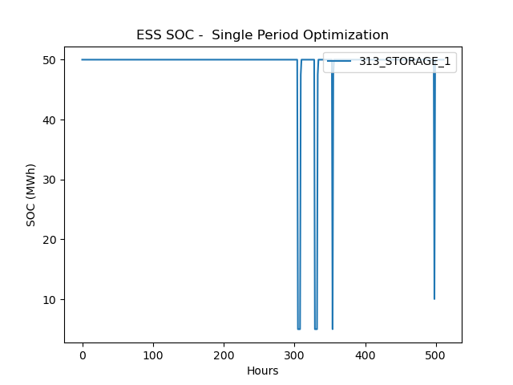 | 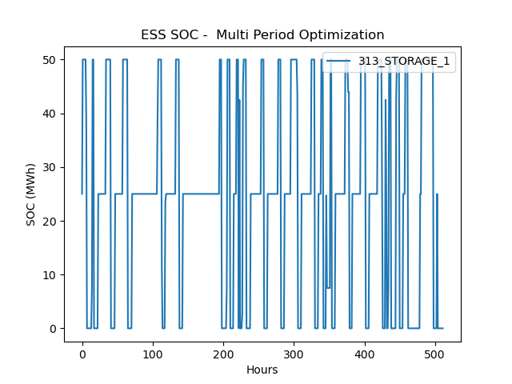 
</p>

**b) Cathode-chemistry specific degradation models:**

ProGRESS now supports cathode-chemistry specific battery degradation models for energy storage systems. Users can now specify the cell cathode chemistry in the [storage.csv](./progress/Data/System/storage.csv) file. Currently, there are four battery chemistry choices: LMO (derived from [Xu et. al.](https://ieeexplore.ieee.org/document/7488267)) and LFP, NMC, NCA (derived from [Preger et. al.](https://iopscience.iop.org/article/10.1149/1945-7111/abae37/meta)). Details on the stress-factor-based degradation models using in this tool can be found in [this paper](https://ieeexplore.ieee.org/abstract/document/11404120). For degradation analysis, in the [input.yaml](progress/input.yaml) file, following parameters need to be provided:

| Parameter                | Comments                                                                                                                                                                                                       |
| ------------------------ | -------------------------------------------------------------------------------------------------------------------------------------------------------------------------------------------------------------- |
| `evaluate_degradation`   | Set to True to consider energy storage degradation in the simulation.                                                                                                                                          |
| `degradation_interval`   | Use this parameter (in hours) to configure how often degradation is evaluated and enforced. Recommended: 168 hours (1 week) or more.                                                                           |
| `detailed_thermal_model` | Set to True to use detailed [PyBaMM](https://pybamm.org/) thermal model for degradation calculations. Enabling this option will increase computation time. If set to False, constant 25 C temperature is used. |

Users can view the impacts of cell degradation and failures in the `ESS_cap.pdf` file, which can be found in the `Results` folder.

| 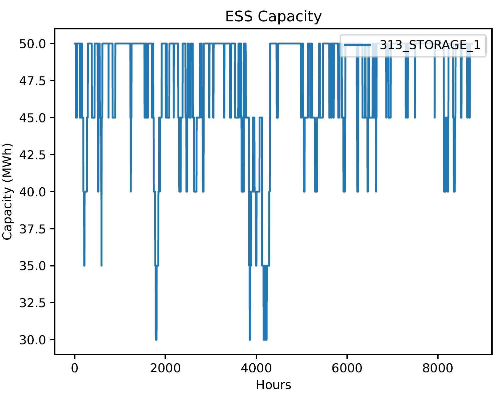 | 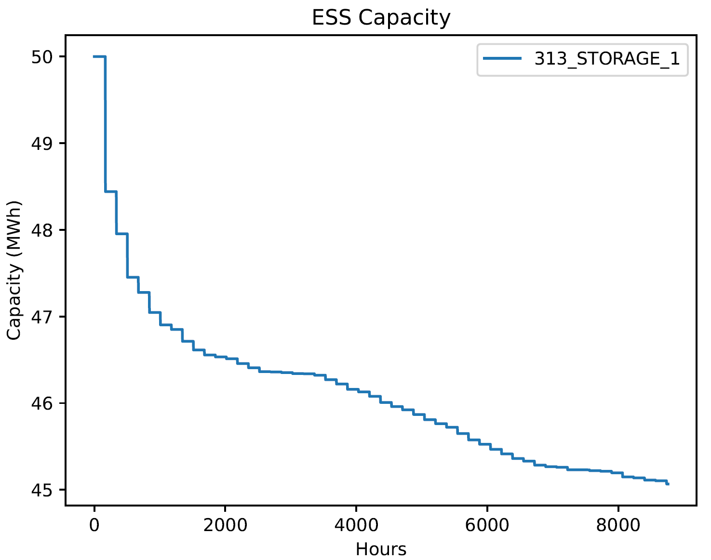 | 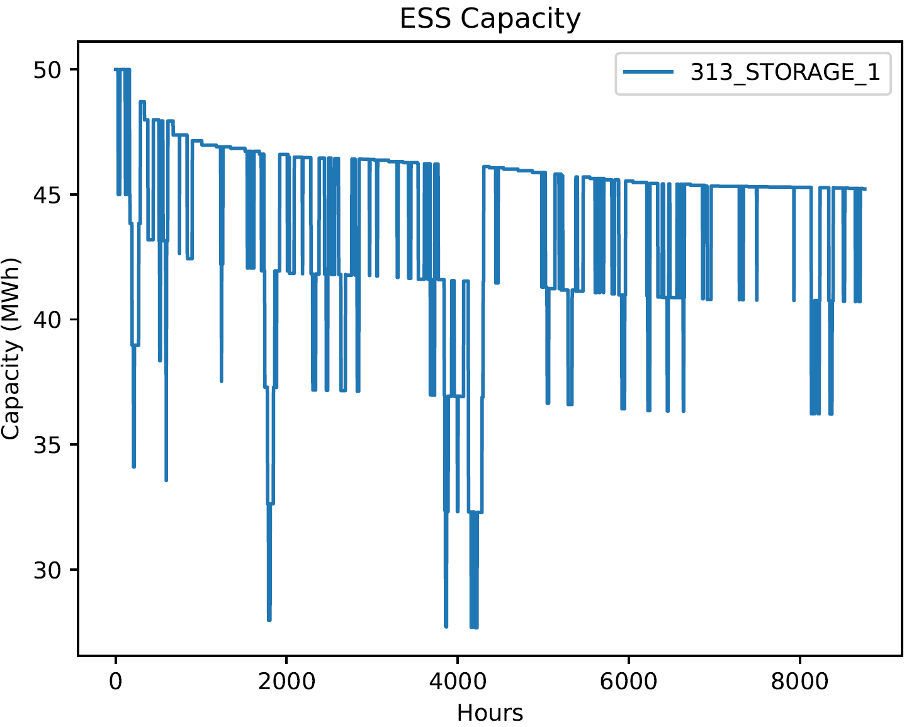 |
|:------------------------------:|:------------------------------:|:------------------------------:|
| (a) Capacity failure only | (b) Capacity degradation only | (c) Combined failure and degradation |

**c) High-Fidelity Production Cost Simulations within ProGRESS:**

ProGRESS now supports Production Cost Modeling (PCM) simulations within its Monte Carlo reliability assessment framework. To use this capability, the [QuESt PCM](<https://github.com/sandialabs/quest_PCM>) tool must be downloaded and installed. During a ProGRESS simulation, stochastic scenarios are generated and automatically exported to QuESt PCM, where they are used to perform detailed nodal production cost simulations. QuESt PCM executes a series of day-ahead unit commitment while modeling conventional generators, renewable resources, energy storage systems, transmission constraints, and ancillary service markets in detail. This integrated workflow enables users to assess the operational and economic impacts of stochastic reliability events using a high-fidelity production cost model. The following steps describe how to configure and run the integrated framework.

- **Clone the QuESt PCM tool into your machine:** The ``progress_integration`` branch of QuESt PCM needs to be used using the command below:
```bash
git clone -b progress_integration https://github.com/sandialabs/quest_PCM.git
```

- **Create a QuESt PCM virtual environment:** Using python 3.12, create the virtual environment as follows:
```bash
# On Windows:
py -3.12 -m venv pcm_venv
# On macOS/Linux:
python3.12 -m venv pcm_venv
```

> **Note:** On macOS, `python3.12` is typically installed via Homebrew. If you don't have it, run `brew install python@3.12`. The resulting venv's python executable will be at `<path_to_quest_PCM>/pcm_venv/bin/python3.12`.

- **Install QuESt PCM:**  With the virtual environment activated, install QuESt PCM and it's dependencies as follows:
```bash
pip install -e .
```

- **Populate required parameters in the config file:** The config `input.yaml` file must contain the following parameters:

| Parameter      | Comments                   |
|--------------|-----------------------------------|
|`pcm_venv_path`| Full path to the QuESt PCM virtual environment python executable. Example: "C:/John_Doe/snl-progress/progress_venv/Scripts/python.exe". 
|`start_date`|  start date for PCM simulation in MM/DD/YYYY format. End date is determined based on user defined `sim_hours`.|
|`solver`| Solver to be used for PCM optimization; Options are 'gurobi', 'cplex', 'cbc', etc. |
|`mipgap`| MIP gap for PCM optimization; lower values lead to more optimal solutions but increase computation time. |
|`solve_pricing_problem`| True/False based on whether user wants to solve the pricing problem in PCM. Increases computation time but generates LMPs, revenues, etc.|
|`storage_AS_mode`| True/False based on whether user wants to include BESS participating in ancillary services.|

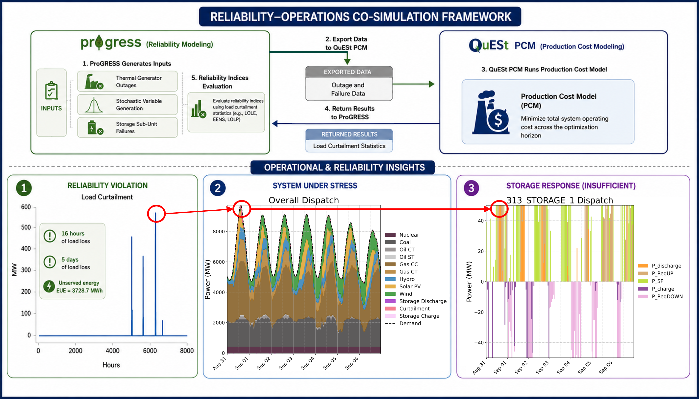 


[Back to Top](#top)

## Citing ProGRESS

<a id="cite"></a>

If you use ProGRESS in your research, please cite the following paper:

A. Bera, C. J. Newlun, A. Lopez, Y. -J. Pomeroy, T. Nguyen and R. Byrne, "Probabilistic Grid Reliability Analysis with Energy Storage System (ProGRESS): An Open-Source Tool for Assessing the Reliability of Power Systems," 2025 IEEE Electrical Energy Storage Applications and Technologies Conference (EESAT), Charlotte, NC, USA, 2025, pp. 1-5, doi: 10.1109/EESAT62935.2025.10891214.

Bibtex Entry:

@inproceedings{bera2025probabilistic, <br>
title={Probabilistic Grid Reliability Analysis with Energy Storage System (ProGRESS): An Open-Source Tool for Assessing the Reliability of Power Systems}, <br>
author={Bera, Atri and Newlun, Cody J and Lopez, Andres and Pomeroy, Yung-Jai and Nguyen, Tu and Byrne, Ray}, <br>
booktitle={2025 IEEE Electrical Energy Storage Applications and Technologies Conference (EESAT)}, <br>
pages={1--5}, <br>
year={2025}, <br>
organization={IEEE} <br>
}

## Acknowledgment

<a id="acknowledgement"></a>
The ProGRESS tool is developed and maintained by the [Energy Storage Analytics Group](https://energy.sandia.gov/programs/energy-storage/analytics/) at [Sandia National Laboratories](https://www.sandia.gov/). This material is based upon work supported by the **U.S. Department of Energy, Office of Electricity (OE), Energy Storage Division**.

**Project team:**

- Atri Bera
- Andres Lopez
- Yung-Jai Pomeroy
- Cody Newlun
- Tu Nguyen
- Dilip Pandit

|  |  |
| ------------------------------------------------------------------------------------- | ----------------------------------------------------------------------------------------------- |

[Back to Top](#top)

## Contact

<a id="contact"></a>

For reporting bugs and other issues, please use the "Issues" feature of this repository. For more information regarding the tool and collaboration opportunities, please contact project developer: Atri Bera (`abera@sandia.gov`)
